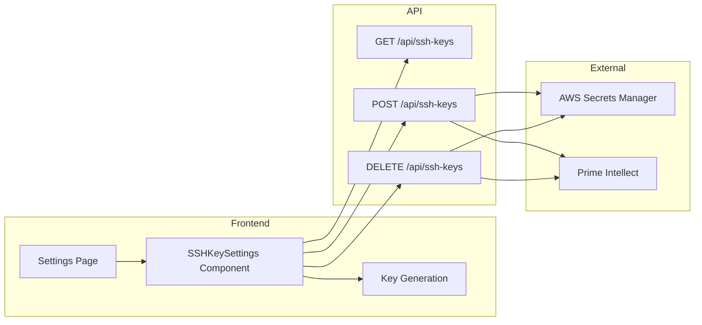

# SSH Key Management UI Implementation

## Summary

Add SSH key management to the Settings page with support for both generating new keys and uploading existing key pairs. This requires new API endpoints and a new frontend component.

## Architecture



## Backend Changes

### 1. Add GET and DELETE endpoints to [apps/api/routers/ssh_keys.py](apps/api/routers/ssh_keys.py)

**GET /api/ssh-keys** - Check if user has a configured key:

- Return `{ configured: false }` if no key
- Return `{ configured: true, public_key: "...", created_at: "..." }` if key exists

**DELETE /api/ssh-keys** - Remove user's SSH key:

- Delete from Prime Intellect (need to add `delete_prime_ssh_key` service function)
- Delete secret from AWS Secrets Manager (need to add `delete_private_key_secret` service function)
- Delete row from database

### 2. Add delete functions to services

**[apps/api/services/aws_secrets_manager.py](apps/api/services/aws_secrets_manager.py)**:

- Add `delete_private_key_secret(secret_arn: str)` function

**[apps/api/services/prime_intellect.py](apps/api/services/prime_intellect.py)**:

- Add `delete_prime_ssh_key(key_id: str)` function

## Frontend Changes

### 3. Add server actions to [apps/web/app/actions/api.ts](apps/web/app/actions/api.ts)

```typescript
// New actions to add:
export async function getSSHKeyStatus();
export async function uploadSSHKey(publicKey: string, privateKey: string);
export async function deleteSSHKey();
export async function generateSSHKeyPair(); // Generate on server for security
```

### 4. Create SSHKeySettings component at `apps/web/components/ssh-key-settings.tsx`

Following the pattern from [GitHubSettings](apps/web/components/github-settings.tsx):

- States: loading, disconnected, connected, error
- "Connected" state: Show public key fingerprint, created date, Delete button
- "Disconnected" state: Two options:
  - "Generate New Key" - Generates keypair, shows private key for user to save, then uploads
  - "Upload Existing Key" - Form with two textareas (public key, private key)

### 5. Update Settings page at [apps/web/app/(auth)/settings/page.tsx](<apps/web/app/(auth)/settings/page.tsx>)

Add SSH Keys section below GitHub Integration:

```tsx
<div className="border-t pt-6">
  <div className="space-y-4">
    <div>
      <h2 className="text-lg md:text-xl font-semibold">SSH Keys</h2>
      <p className="text-sm text-muted-foreground mt-1">
        Configure SSH keys for GPU pod access
      </p>
    </div>
    <SSHKeySettings />
  </div>
</div>
```

## Key Generation Approach

Generate keys server-side using Node.js `crypto` module (Ed25519 or RSA). The flow:

1. User clicks "Generate New Key"
2. Server generates keypair
3. Server returns private key to user (ONE TIME display with copy button + download option)
4. User confirms they saved the private key
5. Server stores private key in AWS, registers public key with Prime Intellect

## File Changes Summary

| File | Change |

| ------------------------------------------ | -------------------------------- |

| `apps/api/routers/ssh_keys.py` | Add GET and DELETE endpoints |

| `apps/api/services/aws_secrets_manager.py` | Add `delete_private_key_secret` |

| `apps/api/services/prime_intellect.py` | Add `delete_prime_ssh_key` |

| `apps/web/app/actions/api.ts` | Add SSH key server actions |

| `apps/web/components/ssh-key-settings.tsx` | New component |

| `apps/web/app/(auth)/settings/page.tsx` | Import and render SSHKeySettings |
