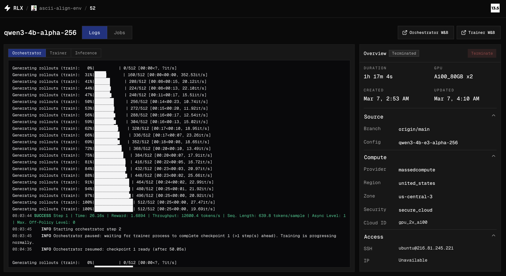
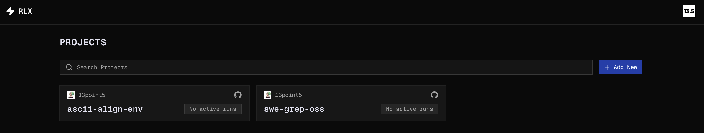
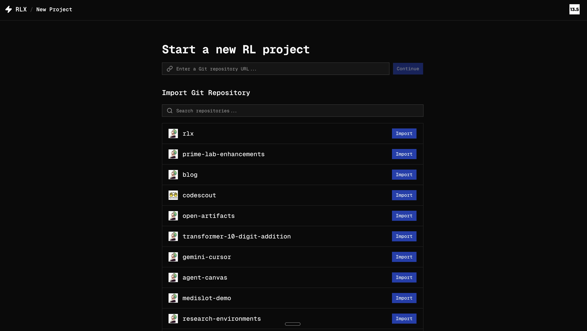
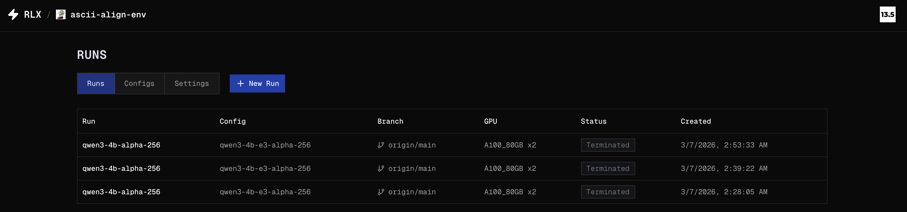
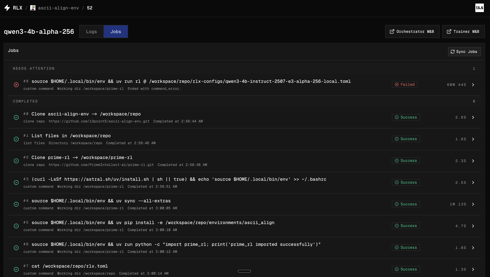
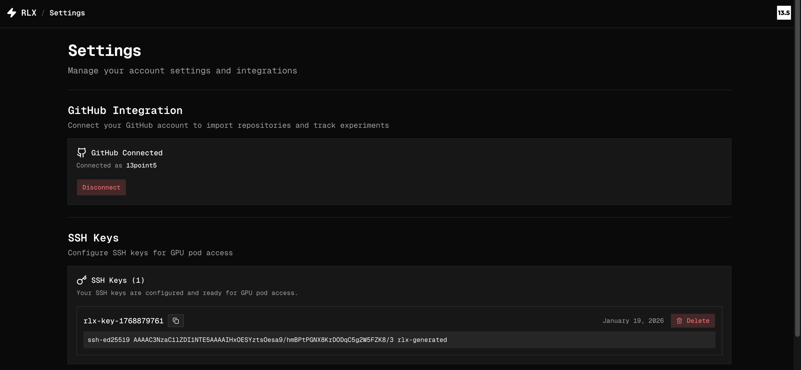
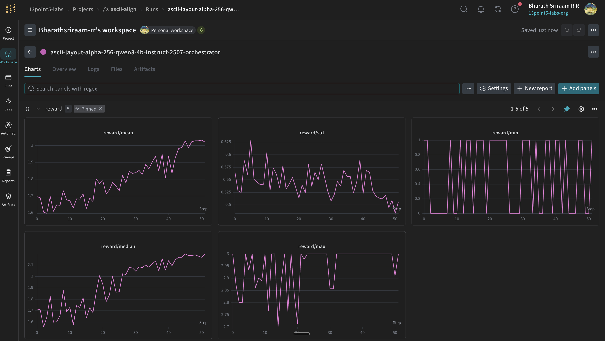
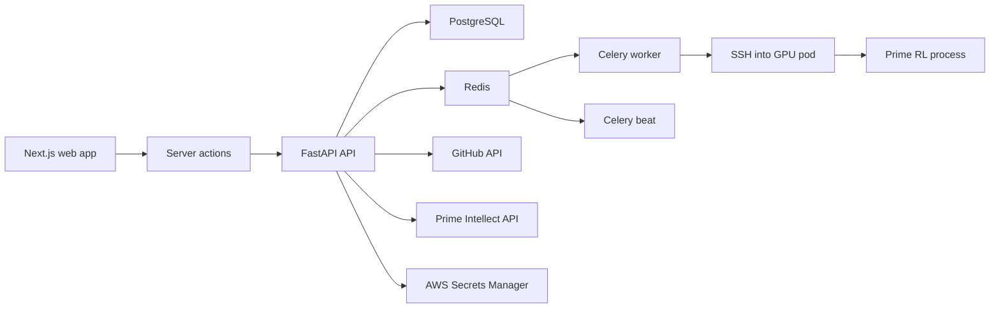

# RLX: Hosted RL Training

This is a hosted RL training platform using [Verifiers](https://github.com/prime-intellect/verifiers) and [Prime RL](https://github.com/prime-intellect/prime-rl).

It lets you import GitHub repositories, choose an `rlx.toml` config, provision Prime Intellect GPU pods, launch Prime RL jobs, and inspect the resulting pipeline through logs, Weights & Biases, job output, and run metadata in one place.



## What RLX does

- Imports GitHub repositories as RL projects.
- Lets you select a branch and named `rlx.toml` config entry for a run.
- Provisions GPU compute on Prime Intellect.
- Boots and prepares the runtime through ordered Celery jobs executed over SSH.
- Surfaces per-run logs for orchestrator, trainer, and inference processes.
- Tracks job execution, command output, retries, and run termination from the UI.
- Stores user SSH keys and integration credentials needed for pod access and monitoring.

## Product Tour

<table>
  <tr>
    <td width="50%">
      
      <p><strong>Projects</strong><br/>Browse imported repositories and jump into active work quickly.</p>
    </td>
    <td width="50%">
      
      <p><strong>New project</strong><br/>Import from GitHub search results or start from a repository URL.</p>
    </td>
  </tr>
  <tr>
    <td width="50%">
      
      <p><strong>Runs</strong><br/>Scan configs, branches, GPU selections, status, and creation time at a glance.</p>
    </td>
    <td width="50%">
      
      <p><strong>Jobs</strong><br/>Inspect the setup and execution pipeline with grouped status sections and drill into command output.</p>
    </td>
  </tr>
  <tr>
    <td width="50%">
      
      <p><strong>Logs</strong><br/>Watch live run output while keeping critical run metadata and access details nearby.</p>
    </td>
    <td width="50%">
      
      <p><strong>Settings</strong><br/>Manage GitHub connectivity and SSH keys required for provisioning and pod access.</p>
    </td>
  </tr>
  <tr>
    <td colspan="2">
      
      <p><strong>Weights &amp; Biases</strong><br/>Open experiment dashboards for training curves, reward signals, and run-level monitoring.</p>
    </td>
  </tr>
</table>

## How it works

At a high level, RLX sits between the browser UI, the application backend, and the systems needed to launch and monitor RL workloads.



Typical run flow:

1. Sign in and connect GitHub.
2. Import a repository as a project.
3. Pick a branch, config name, and GPU shape.
4. Create a run and provision a Prime Intellect pod.
5. Wait for the pod to become active.
6. Execute the queued setup jobs over SSH.
7. Launch Prime RL with the resolved config path.
8. Monitor logs, jobs, and run state from the run details page.

## Stack

- Frontend: Next.js 16, React 19, TypeScript, Tailwind CSS 4, shadcn/ui, Clerk
- Backend: FastAPI, SQLAlchemy, Alembic, asyncpg, Pydantic
- Async execution: Redis, Celery worker, Celery beat
- Infra integrations: Prime Intellect, GitHub, AWS Secrets Manager

## Repo layout

```text
rlx/
├── apps/
│   ├── api/        # FastAPI backend
│   └── web/        # Next.js frontend
├── docs/           # Architecture and implementation docs
├── scripts/        # Helper scripts
├── dev.sh          # tmux-based local dev launcher
└── docker-compose.yml
```

## Local development

### Prerequisites

- Node.js 20+
- `pnpm`
- Python 3.13+
- `uv`
- Docker
- Redis
- A PostgreSQL database reachable through `DATABASE_URL`
- `tmux` if you want to use `./dev.sh`

### Environment

Create these local env files before starting the stack:

`apps/web/.env.local`

```bash
NEXT_PUBLIC_CLERK_PUBLISHABLE_KEY=pk_...
CLERK_SECRET_KEY=sk_...
API_BASE_URL=http://localhost:8000
```

`apps/api/.env`

```bash
DATABASE_URL=postgresql+asyncpg://...
CLERK_SECRET_KEY=sk_...
GITHUB_CLIENT_ID=...
GITHUB_CLIENT_SECRET=...
```

### Quick start

If you already have your env files and external database ready, the fastest local path is:

```bash
./dev.sh
```

This opens a `tmux` session with:

- Next.js web app
- FastAPI API
- Redis
- Celery worker
- Celery beat

### Docker Compose

You can also run the app services with Docker:

```bash
docker compose up --build
```

This starts:

- `web`
- `api`
- `redis`
- `worker`
- `scheduler`

You still need a valid `DATABASE_URL` configured for the API container.

### Manual startup

Frontend:

```bash
cd apps/web
pnpm install
pnpm dev
```

Backend:

```bash
cd apps/api
uv sync
uv run uvicorn rlx_api.main:app --reload --port 8000
```

Redis:

```bash
docker run -d --name redis -p 6379:6379 redis:7-alpine
```

Worker:

```bash
cd apps/api
uv run celery -A rlx_api.celery_app:celery_app worker --loglevel=info -Q pod_ops,repo_ops
```

Scheduler:

```bash
cd apps/api
uv run celery -A rlx_api.celery_app:celery_app beat --loglevel=info
```

## Useful commands

Frontend:

```bash
cd apps/web
pnpm build
pnpm lint
```

Backend:

```bash
cd apps/api
uv run alembic upgrade head
uv run alembic current
```

## Additional docs

- [Architecture walkthrough](docs/architecture_walkthrough.md)
- [Run flow explanation](docs/run_flow_explanation.md)
- [Log streaming notes](docs/log_streaming.md)
- [RLX config format](docs/rlx_config.md)
