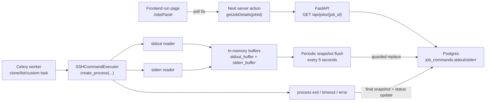
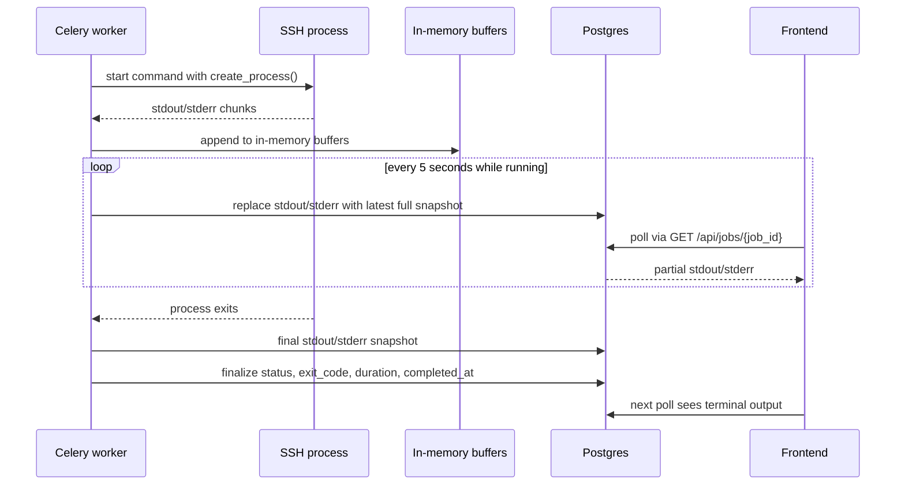

# Live Job Output Polling

## Summary

RLX will keep its current API shape and polling-based UI, but it will start
persisting command output while jobs are still running.

The chosen design is:

- no new endpoints
- no WebSockets or SSE
- no log chunk table
- no GPU telemetry in this pass
- keep `GET /api/jobs?run_id=...` for job status
- keep `GET /api/jobs/{job_id}` for command details
- update `job_commands.stdout` and `job_commands.stderr` in place while the command runs

The worker keeps the live buffer in memory and periodically replaces the stored
DB snapshot with the latest full buffer.

## Why This Approach

This is a hobby-project implementation optimized for simplicity:

- the UI already knows how to poll
- the backend already returns `stdout` and `stderr`
- the job details view already renders terminal output
- most runs have only one active job at a time

Compared with chunked storage, this avoids:

- an extra table
- read-time log assembly
- new API contracts

Compared with append-in-SQL, this avoids duplicate log fragments if a flush is retried.

## Architecture



## Data Flow



## Where State Lives

### In memory

The live buffer exists only inside the Celery worker that is executing the command.

It is not stored in:

- FastAPI memory
- Next.js memory
- Redis

Typical shape:

```text
stdout_buffer: string
stderr_buffer: string
last_flushed_stdout_len: int
last_flushed_stderr_len: int
```

### In PostgreSQL

The database remains the source of truth for what the frontend can read.

`job_commands.stdout` and `job_commands.stderr` become:

- partial snapshots while the command is `RUNNING`
- final complete output once the command is terminal

No extra log table is introduced.

## Replace Model

The worker does not append database text incrementally.

Instead, every flush writes the latest full snapshot:

1. read output from SSH
2. append it to the in-memory buffer
3. every 5 seconds, replace `stdout` and `stderr` in the DB with the current full buffer
4. when the command exits, do one final replace and then finalize command metadata

This is more reliable than append for this project because a repeated flush writes the
same snapshot rather than duplicating bytes.

## Guard Against Stale Replaces

Replacing is only safe if older snapshots cannot overwrite newer ones.

The implementation should only replace a stored output value when the incoming snapshot
is at least as long as what is already stored.

That gives RLX a simple monotonic rule:

- larger snapshot wins
- equal snapshot is harmless
- smaller snapshot is ignored

This prevents a delayed older flush from truncating output.

## Backend Changes

### Executor

`SSHCommandExecutor.execute()` should:

- switch from `conn.run(...)` to `conn.create_process(...)`
- read `stdout` and `stderr` concurrently
- keep building the final `CommandResult`
- periodically invoke a snapshot callback with the latest full `stdout` / `stderr`

It still returns a normal final `CommandResult` so the existing job flow stays intact.

### Database helpers

The Celery task base should support:

- replacing command output snapshots while a command is still running
- finalizing status / exit code / duration / completion metadata at the end

The finalizer should not wipe already-persisted output with an older value.

### Job tasks

`clone_repository`, `list_files`, and `run_custom_command` should all use the live-output path
for the recorded command associated with that job.

The `mkdir` setup call inside clone remains an internal setup step and does not need its own live log row.

## Frontend Changes

The frontend keeps polling.

### Jobs list

`GET /api/jobs?run_id=...` continues to drive:

- step ordering
- job status badges
- running/completed states

### Job details

`GET /api/jobs/{job_id}` should be polled every 5 seconds for a running job so:

- partial `stdout`
- partial `stderr`
- final output

all show up in the existing expanded command view.

No new UI surface is required. The current terminal output component can keep rendering the same fields.

## Out Of Scope

Not included in this change:

- SSE
- WebSockets
- Redis pub/sub log fan-out
- chunk tables
- historical log seek/search features
- GPU telemetry
- combined "run status + all jobs + output" endpoint

## Tradeoffs

### Pros

- lowest implementation complexity
- no new public API
- no migration
- output is visible before command completion
- final output still lands in the same fields the UI already reads

### Cons

- repeated full-text replacements are less efficient than chunk storage
- very large logs mean larger DB writes over time
- if the worker dies between flushes, the most recent unflushed output is lost
- the frontend still has polling latency

These are acceptable tradeoffs for the current project size.

## Acceptance Criteria

This feature is successful when:

1. a long-running job updates `job_commands.stdout` / `stderr` before completion
2. the existing run page shows output growing without manual refresh
3. the same API endpoints continue to work without response-shape changes
4. final output remains intact after the command exits
5. failure, timeout, and cancellation do not erase already-persisted output
