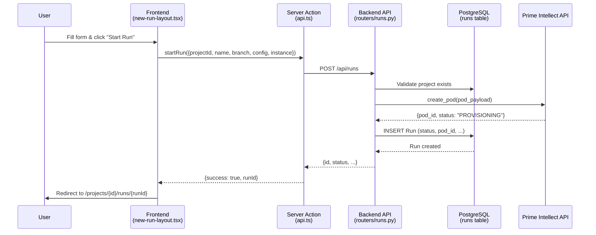
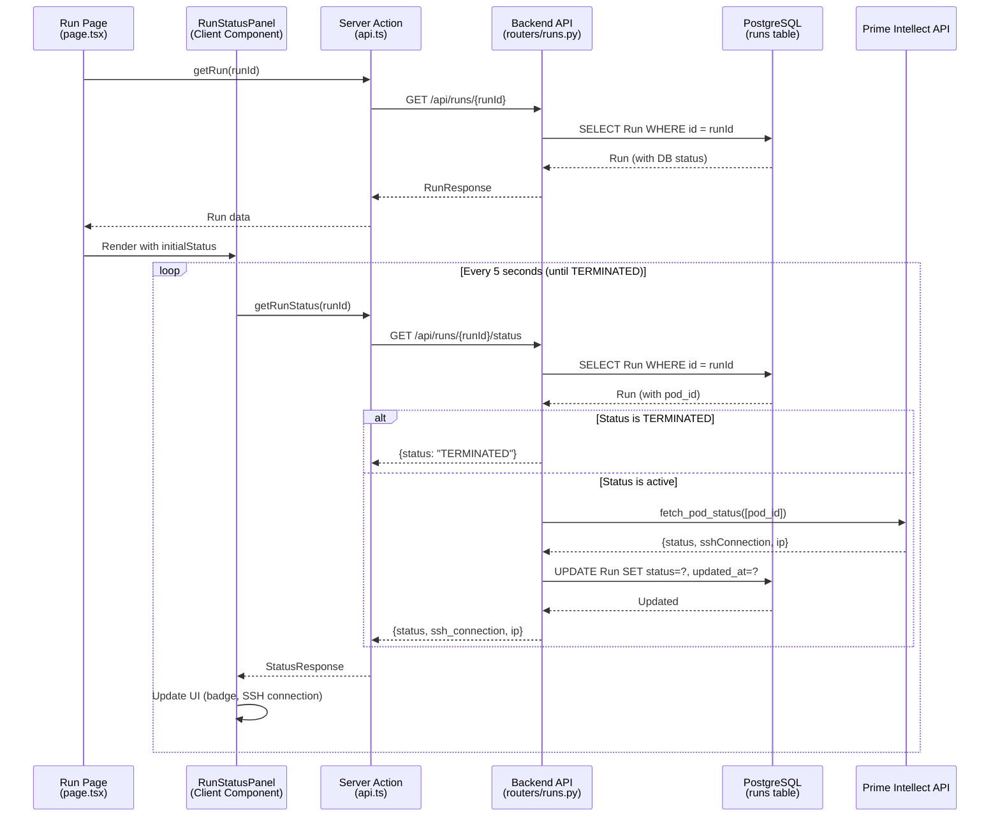
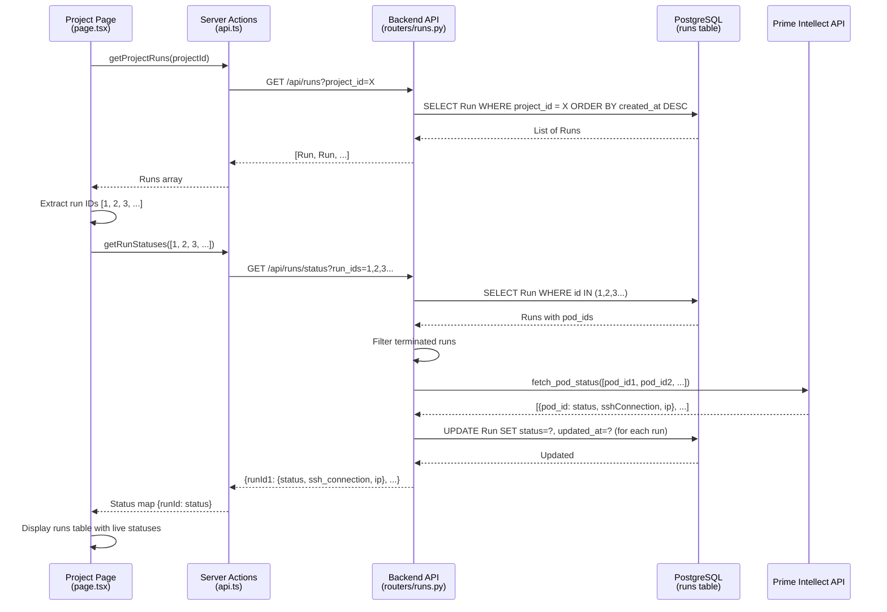

# Run Flow: Creation, Status Updates, and Display

This document explains how runs are created, how their status is tracked and updated, and how they're displayed across the application.

## Overview

A **Run** represents a GPU compute instance provisioned through Prime Intellect API. The system tracks runs from creation through their lifecycle (provisioning → active → terminated).

## Database Schema

The `Run` model (`apps/api/src/rlx_api/database.py`) stores:

```99:126:apps/api/src/rlx_api/database.py
class Run(Base):
    __tablename__ = "runs"

    id = Column(Integer, primary_key=True)
    project_id = Column(Integer, nullable=False, index=True)
    clerk_user_id = Column(String, nullable=False, index=True)
    name = Column(String, nullable=False)
    branch = Column(String, nullable=False)
    config_path = Column(String, nullable=False)
    status = Column(String, nullable=False, default="provisioning")
    provider = Column(String, nullable=False)
    region = Column(String, nullable=False)
    data_center = Column(String)
    country = Column(String)
    gpu_type = Column(String, nullable=False)
    gpu_count = Column(Integer, nullable=False)
    security = Column(String, nullable=False)
    cloud_id = Column(String, nullable=False)
    pod_id = Column(String, nullable=False)
    is_spot = Column(Boolean, nullable=False, default=False)
    created_at = Column(
        DateTime(timezone=True), default=lambda: datetime.now(timezone.utc)
    )
    updated_at = Column(
        DateTime(timezone=True),
        default=lambda: datetime.now(timezone.utc),
        onupdate=lambda: datetime.now(timezone.utc),
    )
```

**Key Fields:**

- `status`: Current run status (PROVISIONING, ACTIVE, TERMINATED, ERROR, etc.)
- `pod_id`: Prime Intellect pod identifier (used to query status)
- `updated_at`: Timestamp of last status update

## Flow Diagrams

### Run Creation Flow

**Mermaid Diagram** (renders in GitHub, VS Code with Mermaid extension, etc.):



**ASCII Diagram**:

```
┌─────────────────────────────────────────────────────────────────────────┐
│                         RUN CREATION FLOW                                │
└─────────────────────────────────────────────────────────────────────────┘

User          Frontend          Server Action      Backend API      PostgreSQL    Prime Intellect
(new-run)     (api.ts)          (runs.py)          (runs table)     API
   │               │                  │                  │               │               │
   │ 1. Submit     │                  │                  │               │               │
   │    form       │                  │                  │               │               │
   ├──────────────>│                  │                  │               │               │
   │               │ 2. startRun()    │                  │               │               │
   │               ├─────────────────>│                  │               │               │
   │               │                  │ 3. POST /api/runs│               │               │
   │               │                  ├─────────────────>│               │               │
   │               │                  │                  │ 4. Validate  │               │
   │               │                  │                  │    project    │               │
   │               │                  │                  ├──────────────>│               │
   │               │                  │                  │               │               │
   │               │                  │                  │ 5. create_pod│               │
   │               │                  │                  ├───────────────────────────────>│
   │               │                  │                  │               │               │
   │               │                  │                  │ 6. {pod_id,   │               │
   │               │                  │                  │    status}    │               │
   │               │                  │                  │<───────────────────────────────┤
   │               │                  │                  │               │               │
   │               │                  │                  │ 7. INSERT Run│               │
   │               │                  │                  ├──────────────>│               │
   │               │                  │                  │               │               │
   │               │                  │                  │ 8. Run saved │               │
   │               │                  │                  │<──────────────┤               │
   │               │                  │                  │               │               │
   │               │                  │ 9. {id, status}  │               │               │
   │               │                  │<─────────────────┤               │               │
   │               │ 10. {runId}      │                  │               │               │
   │               │<─────────────────┤                  │               │               │
   │               │                  │                  │               │               │
   │ 11. Redirect  │                  │                  │               │               │
   │    to run page│                  │                  │               │               │
   │<──────────────┤                  │                  │               │               │
   │               │                  │                  │               │               │
```

### Status Polling Flow (Run Page)

**Mermaid Diagram**:



**ASCII Diagram**:

```
┌─────────────────────────────────────────────────────────────────────────┐
│                      STATUS POLLING FLOW (Run Page)                      │
└─────────────────────────────────────────────────────────────────────────┘

Run Page      RunStatusPanel    Server Action    Backend API    PostgreSQL    Prime Intellect
(page.tsx)    (Client)          (api.ts)         (runs.py)      (runs table)  API
   │               │                 │                │               │               │
   │ 1. Load run   │                 │                │               │               │
   │    details    │                 │                │               │               │
   ├──────────────>│                 │                │               │               │
   │               │                 │ 2. getRun()    │               │               │
   │               │                 ├───────────────>│               │               │
   │               │                 │                │ 3. SELECT Run │               │
   │               │                 │                ├──────────────>│               │
   │               │                 │                │               │               │
   │               │                 │ 4. RunResponse │               │               │
   │               │                 │<───────────────┤               │               │
   │               │                 │                │               │               │
   │ 5. Render     │                 │                │               │               │
   │    Panel      │                 │                │               │               │
   ├──────────────>│                 │                │               │               │
   │               │                 │                │               │               │
   │               │                 │                │               │               │
   │               │ 6. React Query  │                │               │               │
   │               │    starts polling│                │               │               │
   │               │    (every 5s)   │                │               │               │
   │               │                 │                │               │               │
   │               │                 │                │               │               │
   │               │ 7. getRunStatus │                │               │               │
   │               ├─────────────────>│                │               │               │
   │               │                 │ 8. GET /status │               │               │
   │               │                 ├───────────────>│               │               │
   │               │                 │                │ 9. SELECT Run │               │
   │               │                 │                ├──────────────>│               │
   │               │                 │                │               │               │
   │               │                 │                │               │               │
   │               │                 │                │ 10. Check    │               │
   │               │                 │                │    status    │               │
   │               │                 │                │               │               │
   │               │                 │                │               │               │
   │               │                 │                │ 11. fetch_pod │               │
   │               │                 │                │    _status    │               │
   │               │                 │                ├───────────────────────────────>│
   │               │                 │                │               │               │
   │               │                 │                │ 12. {status,   │               │
   │               │                 │                │    ssh, ip}   │               │
   │               │                 │                │<───────────────────────────────┤
   │               │                 │                │               │               │
   │               │                 │                │ 13. UPDATE Run│               │
   │               │                 │                │    SET status │               │
   │               │                 │                ├──────────────>│               │
   │               │                 │                │               │               │
   │               │                 │ 14. StatusResp │               │               │
   │               │                 │<───────────────┤               │               │
   │               │                 │                │               │               │
   │               │ 15. Update UI   │                │               │               │
   │               │    (badge, SSH) │                │               │               │
   │               │<────────────────┤                │               │               │
   │               │                 │                │               │               │
   │               │ [Repeat every 5s│                │               │               │
   │               │  until TERMINATED]               │               │               │
   │               │                 │                │               │               │
```

### Project Page Runs Display

**Mermaid Diagram**:



**ASCII Diagram**:

```
┌─────────────────────────────────────────────────────────────────────────┐
│                    PROJECT PAGE RUNS DISPLAY                              │
└─────────────────────────────────────────────────────────────────────────┘

Project Page    Server Actions    Backend API      PostgreSQL      Prime Intellect
(page.tsx)      (api.ts)          (runs.py)        (runs table)    API
   │                 │                 │                 │                 │
   │ 1. Load        │                 │                 │                 │
   │    project     │                 │                 │                 │
   │    & runs      │                 │                 │                 │
   ├────────────────>│                 │                 │                 │
   │                 │ 2. GET /runs?  │                 │                 │
   │                 │    project_id=X │                 │                 │
   │                 ├────────────────>│                 │                 │
   │                 │                 │ 3. SELECT Run   │                 │
   │                 │                 │    WHERE        │                 │
   │                 │                 │    project_id=X │                 │
   │                 │                 ├────────────────>│                 │
   │                 │                 │                 │                 │
   │                 │ 4. [Run, ...]   │                 │                 │
   │                 │<────────────────┤                 │                 │
   │                 │                 │                 │                 │
   │ 5. Runs array   │                 │                 │                 │
   │<────────────────┤                 │                 │                 │
   │                 │                 │                 │                 │
   │ 6. Extract IDs  │                 │                 │                 │
   │    [1, 2, 3...] │                 │                 │                 │
   │                 │                 │                 │                 │
   │ 7. getRunStatuses│                │                 │                 │
   │    ([1,2,3...]) │                 │                 │                 │
   ├────────────────>│                 │                 │                 │
   │                 │ 8. GET /status? │                 │                 │
   │                 │    run_ids=1,2,3│                 │                 │
   │                 ├────────────────>│                 │                 │
   │                 │                 │ 9. SELECT Run   │                 │
   │                 │                 │    WHERE id IN  │                 │
   │                 │                 ├────────────────>│                 │
   │                 │                 │                 │                 │
   │                 │                 │ 10. Runs with   │                 │
   │                 │                 │     pod_ids     │                 │
   │                 │                 │<────────────────┤                 │
   │                 │                 │                 │                 │
   │                 │                 │ 11. Filter      │                 │
   │                 │                 │    terminated   │                 │
   │                 │                 │                 │                 │
   │                 │                 │ 12. fetch_pod   │                 │
   │                 │                 │    _status      │                 │
   │                 │                 │    ([pod_id1,  │                 │
   │                 │                 │     pod_id2...])│                 │
   │                 │                 ├──────────────────────────────────>│
   │                 │                 │                 │                 │
   │                 │                 │ 13. [{status,   │                 │
   │                 │                 │     ssh, ip},  │                 │
   │                 │                 │     ...]       │                 │
   │                 │                 │<──────────────────────────────────┤
   │                 │                 │                 │                 │
   │                 │                 │ 14. UPDATE Run  │                 │
   │                 │                 │    (for each)   │                 │
   │                 │                 ├────────────────>│                 │
   │                 │                 │                 │                 │
   │                 │ 15. Status map  │                 │                 │
   │                 │    {runId:      │                 │                 │
   │                 │     status}     │                 │                 │
   │                 │<────────────────┤                 │                 │
   │                 │                 │                 │                 │
   │ 16. Status map  │                 │                 │                 │
   │<────────────────┤                 │                 │                 │
   │                 │                 │                 │                 │
   │ 17. Display     │                 │                 │                 │
   │    runs table   │                 │                 │                 │
   │    with live    │                 │                 │                 │
   │    statuses     │                 │                 │                 │
   │                 │                 │                 │                 │
```

## Detailed Flow Breakdown

### 1. Creating a New Run

**Frontend (`apps/web/app/(auth)/projects/[id]/runs/new/new-run-layout.tsx`):**

1. User fills form: name, branch, config path, GPU selection
2. On "Start Run" click, calls `startRun()` server action
3. Server action (`apps/web/app/actions/api.ts`) sends POST to `/api/runs`

**Backend (`apps/api/src/rlx_api/routers/runs.py` - `create_run`):**

1. Validates project exists and belongs to user
2. Validates user has an SSH key configured
3. Builds pod payload with GPU specs and SSH key ID
4. Calls Prime Intellect API `create_pod()` (`apps/api/src/rlx_api/services/prime_intellect.py`)
5. Receives `pod_id` and initial `status` from Prime Intellect
6. Creates `Run` record in database with:
   - Status from Prime Intellect response (or "PROVISIONING" default)
   - All run metadata (name, branch, config, GPU specs, etc.)
   - `pod_id` for future status queries
7. Creates initial jobs from templates (`apps/api/src/rlx_api/job_templates.py`):
   - Clone user's project repo
   - List files in repo
   - Clone prime-rl framework
   - Install uv package manager
   - Install prime-rl dependencies
   - Install user's verifiers environment
   - Verify installation
8. Returns `RunResponse` to frontend

**Frontend:**

- Receives run ID
- Redirects to `/projects/{projectId}/runs/{runId}`

### 2. Viewing Run Status (Individual Run Page)

**Initial Load (`apps/web/app/(auth)/projects/[id]/runs/[runId]/page.tsx`):**

1. Server-side: Calls `getRun(runId)` to fetch run details
2. Passes `initialStatus` to `RunStatusPanel` component

**Status Polling (`apps/web/app/(auth)/projects/[id]/runs/[runId]/run-status-panel.tsx`):**

1. Uses React Query (`useQuery`) with:
   - Query key: `["run-status", runId]`
   - Polling interval: 5 seconds
   - Stops polling when status is "TERMINATED"
2. Each poll calls `getRunStatus(runId)` server action
3. Server action calls `GET /api/runs/{runId}/status`

**Backend (`apps/api/src/rlx_api/routers/runs.py` - `get_run_status`):**

1. Fetches run from database
2. If status is "TERMINATED", returns immediately (no API call)
3. Otherwise, calls Prime Intellect `fetch_pod_status([pod_id])`
4. Extracts status, SSH connection, and IP from response
5. **Updates database** with new status and `updated_at` timestamp
6. Returns `RunStatusResponse` with status, SSH connection, and IP

**Frontend:**

- Updates UI with new status badge
- Displays SSH connection string when available
- Shows error message if API call fails (with last known status)

### 3. Project Page Runs Display

**Initial Load (`apps/web/app/(auth)/projects/[id]/page.tsx`):**

1. Server-side: Calls `getProjectRuns(projectId)` to fetch all runs
2. Extracts run IDs from results
3. Calls `getRunStatuses(runIds)` to batch-fetch live statuses

**Batch Status Fetch (`apps/api/src/rlx_api/routers/runs.py` - `get_runs_status`):**

1. Receives list of run IDs
2. Fetches runs from database
3. Filters out terminated runs (returns DB status immediately)
4. Collects `pod_id`s from active runs
5. Calls Prime Intellect `fetch_pod_status(pod_ids)` with all IDs
6. Maps Prime Intellect responses to runs by `pod_id`
7. **Updates database** for each run with new status
8. Returns `dict[int, RunStatusItem]` mapping run ID to status

**Frontend:**

- Displays runs table
- Shows live status from status map (falls back to DB status)
- Status badges update based on current status

## Status Update Mechanism

### Database Updates

Status is updated in the database in two places:

1. **Individual status endpoint** (`get_run_status`):

   ```python
   run.status = status_value
   run.updated_at = datetime.now(timezone.utc)
   await db.commit()
   ```

2. **Batch status endpoint** (`get_runs_status`):
   ```python
   run.status = status_value
   run.updated_at = datetime.now(timezone.utc)
   # ... for each run
   await db.commit()
   ```

### Status Values

Status values come from Prime Intellect API:

- `PROVISIONING`: Pod is being created
- `PENDING`: Pod is queued
- `ACTIVE`: Pod is running (SSH connection available)
- `STOPPED`: Pod is stopped
- `ERROR`: Pod creation/operation failed
- `TERMINATED`: Pod has been deleted

### Polling Behavior

**Run Page (`RunStatusPanel`):**

- Polls every 5 seconds
- Stops when status is "TERMINATED"
- Handles errors gracefully (shows last known status)
- Uses React Query for automatic retries and caching

**Project Page:**

- Fetches status once on initial load (server-side)
- No client-side polling (static page)
- Status may be stale until page refresh

## Key Components

### Frontend

- **`new-run-layout.tsx`**: Form for creating runs
- **`run-status-panel.tsx`**: Client component that polls and displays status
- **`page.tsx` (run)**: Server component that loads initial run data
- **`page.tsx` (project)**: Server component that lists all runs

### Backend

- **`routers/runs.py`**: API endpoints for run CRUD and status
- **`services/prime_intellect.py`**: Prime Intellect API client
- **`database.py`**: Run model definition

### API Endpoints

- `POST /api/runs`: Create new run
- `GET /api/runs/{run_id}`: Get run details
- `GET /api/runs/{run_id}/status`: Get live status (reads from DB)
- `GET /api/runs/status?run_ids=...`: Batch get statuses (reads from DB)
- `GET /api/runs?project_id=X`: List runs for project
- `POST /api/runs/{run_id}/terminate`: Terminate run
- `POST /api/runs/{run_id}/sync-jobs`: Add missing jobs from current template to existing run

## Error Handling

### Prime Intellect API Errors

When Prime Intellect API fails:

- Backend catches `PrimeIntellectAPIError`
- Returns HTTP error with details
- Frontend shows error message
- For status endpoints, includes `last_known_status` and `last_updated_at` in error payload

### Database Status Fallback

- If Prime Intellect API is unavailable, frontend uses database status
- Project page shows DB status if batch fetch fails
- Run page shows last known status on error

## Performance Considerations

1. **Batch Status Fetching**: Project page uses batch endpoint to avoid N+1 queries
2. **Terminated Run Optimization**: Terminated runs skip Prime Intellect API calls
3. **Polling Interval**: 5-second interval balances freshness vs. API load
4. **Database Updates**: Status updates happen synchronously during status fetches (ensures consistency)
